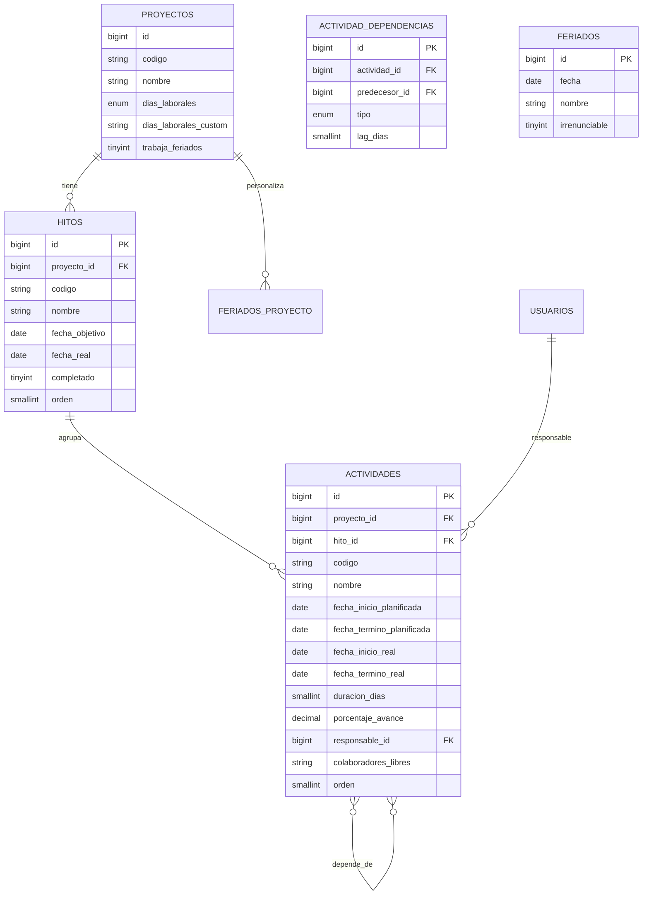

# Modelo de Datos — Fase 2-C: Gantt Jerárquico

**Prefijo:** `gmc_` (igual que Fase 1).
**Charset:** `utf8mb4_unicode_ci`.
**Engine:** `InnoDB`.
**Tablas nuevas:** 4.
**Cambios a Fase 1:** 3 columnas nuevas en `gmc_proyectos` (aditivo, no rompe nada).

---

## 1. DER



---

## 2. Cambios en `gmc_proyectos` (Fase 1)

Agregar al final, antes de timestamps:

```sql
ALTER TABLE `gmc_proyectos`
  ADD COLUMN `dias_laborales` ENUM('lun_vie','lun_sab','lun_dom','personalizado')
                              NOT NULL DEFAULT 'lun_vie' AFTER `valor_uf_referencia`,
  ADD COLUMN `dias_laborales_custom` VARCHAR(20) NULL AFTER `dias_laborales`,
  ADD COLUMN `trabaja_feriados` TINYINT(1) UNSIGNED NOT NULL DEFAULT 0 AFTER `dias_laborales_custom`;
```

- `dias_laborales`: enum simple para los 3 casos comunes.
- `dias_laborales_custom`: usado sólo si es `personalizado`. Formato `"L,Mi,V,S"` (cada día separado por coma).
- `trabaja_feriados`: si en feriados oficiales se trabaja igual.

## 3. Tabla `gmc_hitos`

| Columna | Tipo | Notas |
|---|---|---|
| `id` | BIGINT PK | |
| `proyecto_id` | BIGINT FK → gmc_proyectos | ON DELETE CASCADE |
| `codigo` | VARCHAR(20) | Generado: `HT-OBR-2026-001-01` |
| `nombre` | VARCHAR(180) NOT NULL | |
| `descripcion` | VARCHAR(500) NULL | |
| `fecha_objetivo` | DATE NULL | Fecha planificada de cumplimiento |
| `fecha_real` | DATE NULL | Cuando se cumple efectivamente |
| `completado` | TINYINT(1) DEFAULT 0 | |
| `porcentaje_avance` | DECIMAL(5,2) DEFAULT 0 | Calculado desde actividades |
| `orden` | SMALLINT NOT NULL DEFAULT 0 | Para ordenar en el Gantt |
| `created_at, updated_at, deleted_at, created_by, updated_by` | timestamps + audit | |

**Índices:** `(proyecto_id, orden)`, `(proyecto_id, completado)`.

## 4. Tabla `gmc_actividades`

| Columna | Tipo | Notas |
|---|---|---|
| `id` | BIGINT PK | |
| `proyecto_id` | BIGINT FK → gmc_proyectos | RESTRICT |
| `hito_id` | BIGINT NULL FK → gmc_hitos | NULL si la actividad va suelta. Default: SET NULL si se borra hito. |
| `codigo` | VARCHAR(20) | `ACT-OBR-2026-001-001` |
| `nombre` | VARCHAR(180) NOT NULL | |
| `descripcion` | VARCHAR(500) NULL | |
| `fecha_inicio_planificada` | DATE NOT NULL | |
| `fecha_termino_planificada` | DATE NOT NULL | |
| `fecha_inicio_real` | DATE NULL | |
| `fecha_termino_real` | DATE NULL | |
| `duracion_dias` | SMALLINT UNSIGNED NOT NULL | Duración en **días laborales del proyecto** |
| `porcentaje_avance` | DECIMAL(5,2) DEFAULT 0 | 0–100, manual |
| `responsable_id` | BIGINT NULL FK → gmc_usuarios | |
| `colaboradores_libres` | VARCHAR(255) NULL | Texto libre, no es FK |
| `es_critica` | TINYINT(1) DEFAULT 0 | Calculado por CPM cada vez que se recalcula |
| `holgura_dias` | SMALLINT DEFAULT 0 | Calculado por CPM (slack) |
| `orden` | SMALLINT NOT NULL DEFAULT 0 | |
| `created_at, updated_at, deleted_at, created_by, updated_by` | | |

**Índices:** `(proyecto_id, hito_id, orden)`, `(responsable_id)`, `(fecha_termino_planificada)`, `(es_critica)`.

## 5. Tabla `gmc_actividad_dependencias`

| Columna | Tipo | Notas |
|---|---|---|
| `id` | BIGINT PK | |
| `actividad_id` | BIGINT FK → gmc_actividades | "Sucesora", la que depende |
| `predecesor_id` | BIGINT FK → gmc_actividades | "Antecesora" |
| `tipo` | ENUM('FS','SS','FF','SF') DEFAULT 'FS' | Finish-Start (más común), Start-Start, Finish-Finish, Start-Finish |
| `lag_dias` | SMALLINT DEFAULT 0 | Días de retraso/adelanto entre las dos. Negativo = lead time. |
| `created_at` | TIMESTAMP | |

**Constraint:** `UNIQUE (actividad_id, predecesor_id)` para evitar duplicar dependencia.
**Validación a nivel servicio:** rechazar dependencias circulares (A→B→C→A).

### Tipos de dependencia explicados

| Tipo | Significado | Caso típico |
|---|---|---|
| **FS** Finish-to-Start | El predecesor termina antes que arranque el sucesor | Pintura espera que termine Estuco |
| **SS** Start-to-Start | Ambos arrancan al mismo tiempo | Excavación y Compactación arrancan en paralelo |
| **FF** Finish-to-Finish | Ambos terminan al mismo tiempo | Inspección de calidad termina cuando termina la actividad inspeccionada |
| **SF** Start-to-Finish | Predecesor arranca antes que sucesor termine | Raro; auditoría de turno: el siguiente turno debe terminar después de empezar |

`lag_dias` permite ajustar: ej. FS con lag=3 significa "Pintura empieza 3 días después de que termine Estuco" (tiempo de fragüe).

## 6. Tabla `gmc_feriados`

| Columna | Tipo | Notas |
|---|---|---|
| `id` | BIGINT PK | |
| `fecha` | DATE UNIQUE | |
| `nombre` | VARCHAR(120) | "Año Nuevo", "Día del Trabajo", etc. |
| `irrenunciable` | TINYINT(1) DEFAULT 0 | Para diferenciar feriados con ley |
| `tipo` | VARCHAR(40) NULL | "civil", "religioso", "regional" |

**Seed con feriados oficiales de Chile 2026:**

| Fecha | Nombre | Irrenunciable |
|---|---|---|
| 2026-01-01 | Año Nuevo | Sí |
| 2026-04-03 | Viernes Santo | No |
| 2026-04-04 | Sábado Santo | No |
| 2026-05-01 | Día del Trabajo | Sí |
| 2026-05-21 | Día de las Glorias Navales | No |
| 2026-06-29 | San Pedro y San Pablo | No |
| 2026-07-16 | Virgen del Carmen | No |
| 2026-08-15 | Asunción de la Virgen | No |
| 2026-09-18 | Independencia Nacional | Sí |
| 2026-09-19 | Día de las Glorias del Ejército | Sí |
| 2026-10-12 | Encuentro de Dos Mundos | No |
| 2026-10-31 | Día de las Iglesias Evangélicas | No |
| 2026-11-01 | Día de Todos los Santos | No |
| 2026-12-08 | Inmaculada Concepción | No |
| 2026-12-25 | Navidad | Sí |

> Para 2027 y siguientes, el admin actualiza el seed o mantiene la tabla manualmente. Posibilidad futura: integración con API de feriados oficiales.

## 7. Reglas de negocio (invariantes)

1. Toda actividad pertenece a un proyecto. Si pertenece a un hito, ese hito debe ser del mismo proyecto.
2. `fecha_termino_planificada >= fecha_inicio_planificada`.
3. La duración en días debe coincidir con la diferencia entre fechas, **considerando los días laborales del proyecto**. Si no, el sistema recalcula.
4. No se permiten dependencias circulares (validar al guardar).
5. Una actividad no puede depender de sí misma.
6. `porcentaje_avance` entre 0 y 100.
7. El `porcentaje_avance` del hito = promedio ponderado por duración de sus actividades.
8. Cuando todas las actividades de un hito tienen `porcentaje_avance = 100`, el hito se marca `completado = 1` automáticamente.
9. La ruta crítica se recalcula cada vez que se modifica una actividad o dependencia.
10. Sólo proyectos en estado `planificacion` o `en_ejecucion` permiten editar el Gantt. En `cerrado`, sólo lectura.

## 8. Convenciones de correlativo

| Documento | Patrón | Ejemplo |
|---|---|---|
| Hito | `HT-{codigo_proyecto}-{NN}` | `HT-OBR-2026-001-03` |
| Actividad | `ACT-{codigo_proyecto}-{NNN}` | `ACT-OBR-2026-001-027` |

Generados por `CorrelativoService` agregando los dominios `hito` y `actividad`.

## 9. Permisos nuevos (ACL)

```
obras.gantt.ver          Ver Gantt y sus actividades
obras.gantt.editar       Crear/editar/eliminar hitos y actividades
obras.gantt.dependencia  Crear/editar dependencias
obras.gantt.exportar     Exportar Gantt a PDF/PNG
obras.feriado.editar     Administrar feriados (sólo admin)
```

Asignación sugerida en seed:

| Permiso | admin | gerencia | jefe_proyecto | otros |
|---|:---:|:---:|:---:|:---:|
| `obras.gantt.ver` | ✓ | ✓ | ✓ | ver según rol existente |
| `obras.gantt.editar` | ✓ | ✓ | ✓ (su proyecto) | — |
| `obras.gantt.dependencia` | ✓ | ✓ | ✓ (su proyecto) | — |
| `obras.gantt.exportar` | ✓ | ✓ | ✓ | contabilidad: sólo lectura/export |
| `obras.feriado.editar` | ✓ | — | — | — |

## 10. Migración aditiva

Una sola migración `20260615000001_crear_gantt_y_calendario.php`:
1. ALTER `gmc_proyectos` con las 3 columnas nuevas.
2. CREATE `gmc_feriados` + seed Chile 2026.
3. CREATE `gmc_hitos`.
4. CREATE `gmc_actividades`.
5. CREATE `gmc_actividad_dependencias`.
6. INSERT en `gmc_correlativos` (dominios `hito`, `actividad`).
7. INSERT permisos nuevos en `gmc_permisos`.
8. Asignación en `gmc_roles_permisos`.

**No requiere downtime ni afecta los datos existentes.**
